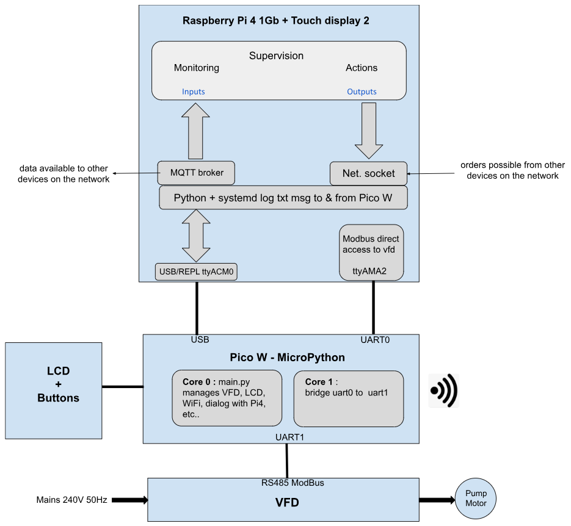
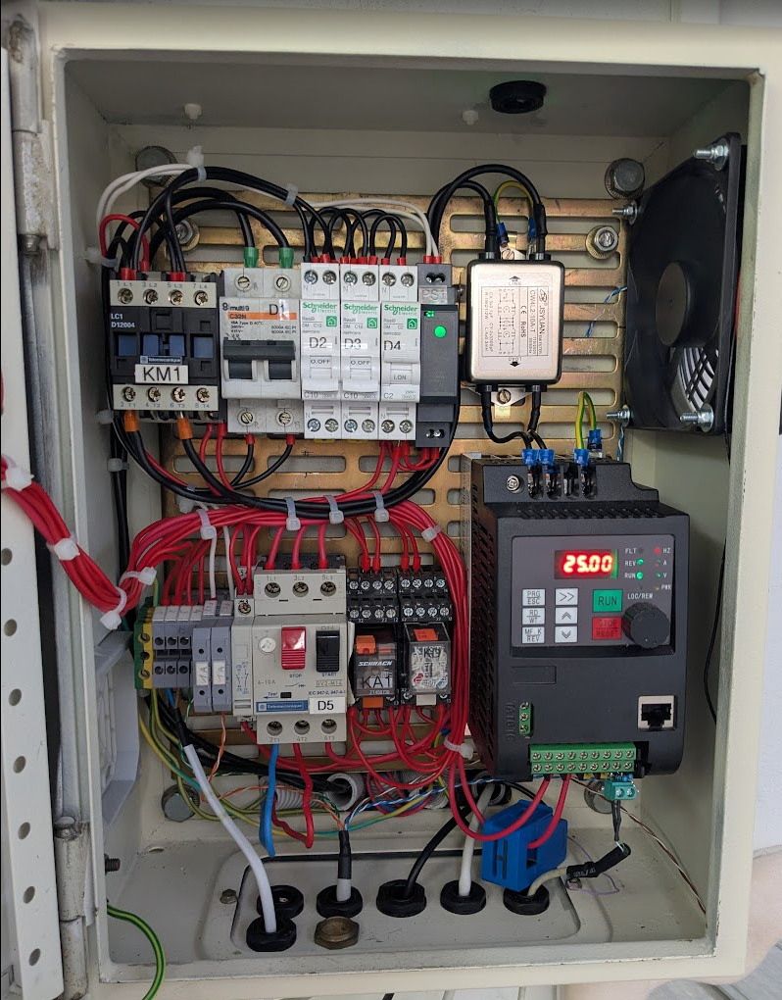
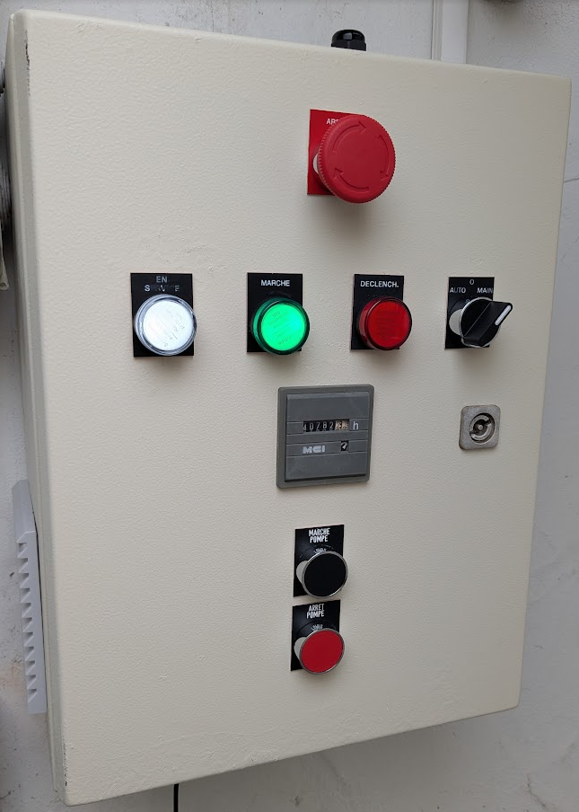
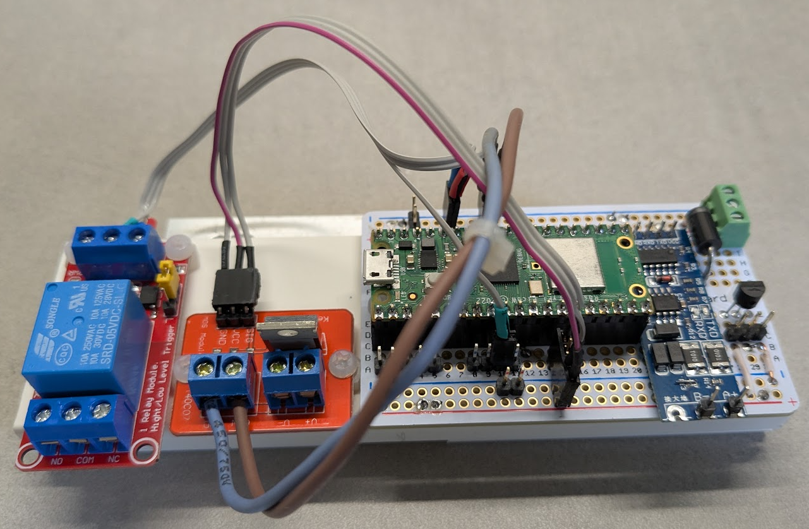
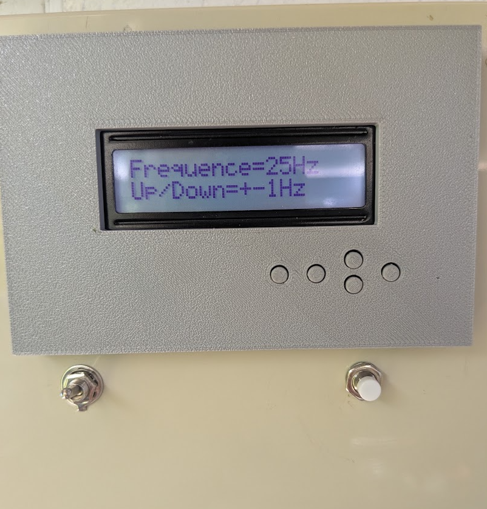
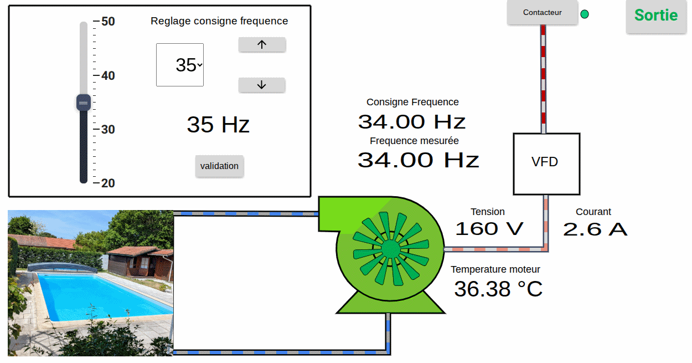
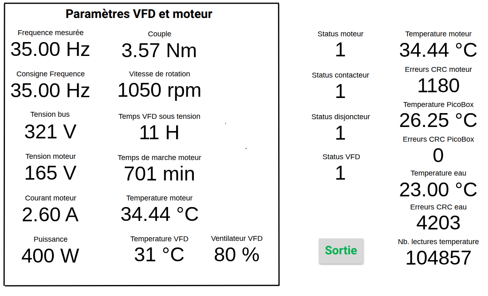

# VFD (Variable Frequency Drive) on swimming pool water pump.  

# Contents  

1. [Introduction](./README.md#1-introduction)   
    1.1 [Why a VFD](./README.md#11-why-a-vfd)   
    1.2 [VFD overview](./README.md#12-vfd-overview)    
    1.3 [Project overview](./README.md#13-project-overview)  
    1.4 [Project architecture](./README.md#14-project-architecture)  
    1.5 [Documentation](./README.md#15-documentation)   
2. [Hardware](./README.md#2-hardware)   
    2.1 [Electrical cabinet](./README.md#21-electrical-cabinet)   
    &nbsp;&nbsp;&nbsp;&nbsp;&nbsp;2.1.1 [Cabinet main components](./README.md#211-cabinet-components)   
    &nbsp;&nbsp;&nbsp;&nbsp;&nbsp;2.1.2 [VFD settings](./README.md#212-vfd-settings)   
    2.2 [Microcontroller Pico W](./README.md#22-microcontroller-raspberry-pi-pico-w)   
    &nbsp;&nbsp;&nbsp;&nbsp;&nbsp;2.2.1 [Pico Hardware](./README.md#221-pico-hardware)   
    &nbsp;&nbsp;&nbsp;&nbsp;&nbsp;2.2.2 [Pico Software](./README.md#222-pico-software)   
    2.3 [Supervisor Pi4](./README.md#23-supervisor-raspberry-pi-4)   
  
  
# TEST TESTS   
# UNDER WORKS  
  

# 1. Introduction   

This page describes the installation of a VFD (Variable Frequency Drive) on a swimming pool pump and its control system.  
The description of the full system includes the electrical part with the VFD itself, the microcontroller with its software to drive the VFD
and the supervision computer with its software.  
However more simple tools are also included here such as direct PC (or microcontroller) to VFD software.  

## 1.1 Why a VFD?   

Pool professionals explain that a variable speed drive on the pump is beneficial because running the pump at a lower speed improves filtration—as the water remains in the filter longer—and allows for extended filtration cycles.  
The principle behind a VFD is simple: the rotational speed of an induction motor depends on the frequency. A VFD varies the frequency, thereby adjusting the motor's speed.  

## 1.2 VFD overview   

The VFD is from CNWeiken the model is **WK600D-0022-M1T : 1 phase 2.2kW**.  
This VFD was bought on [AliExpress](https://fr.aliexpress.com/item/1005007804372091.html?pdp_npi=4%40dis%21EUR%21%E2%82%AC%2083%2C68%21%E2%82%AC%2054%2C39%21%21%2196.00%2162.40%21%402103835e17588183866768574e4166%2112000042258239052%21sh%21FR%210%21X&spm=a2g0o.store_pc_allItems_or_groupList.new_all_items_2007523647771.1005007804372091&gatewayAdapt=glo2fra).  
The swimming pool pump motor is rated **230Vac 50Hz 5.5A 1.2kW**.  

## 1.3 Project overview  

There are 3 main components:   
 - The electrical cabinet hosting the VFD and necessary accessories.  
 - The microcontroller and its software to drive the VFD (a Raspberry pi Pico W and MicroPython)  
 - The supervisor: a Raspberry Pi 4 1Gb + Touch display 2 running Fuxa SCADA.  

The pump must be able to run even if a component fails. To achieve this there is a full manual mode at the electrical level. 
Furthermore the Pico is able to run even if the supervisor is out of order.
A LCD screen and push buttons permit to drive the pump.
And finally the supervisor is connected to the home network but the Scada can run and drive the VFD even without network.

The Pico W WiFi is always off and can be switched on by a push button, it is then possible to drive the system from a web page.  

Driving the system from the supervisor, the LCD, WiFi or even from other devices on the network includes: start/stop the pump, open/close the contactor to energize the VFD, set the frequency (the pump speed), define the pump daily program, and other utility tasks.
 
## 1.4 Project architecture

## 1.5 Documentation
   
The VFD documentation can be found on [CNWeiken website](http://www.cnweiken.cn/upload/files/20230819/6382804255758362504914814.pdf?spm=a2g0o.detail.1000023.3.911b2tC62tC61r&file=6382804255758362504914814.pdf).     
A copy of this doc + the Modbus documentation is on this repository in the Documentation folder.  
  
# 2. Hardware

## 2.1 Electrical cabinet  

### 2.1.1 Cabinet components

**Here are photos of the VFD in its cabinet.**

The cabinet [single line diagram](./Hardware/SchemaElectrique.pdf) is available in the hardware folder.  

Downstream the main breaker there are 4 feeders: 1 for the 5V/3A Pico power supply, 1 contactor for the VFD and 2 spares.  
Even if the VFD can remain always energized, I choosed to feed it by a contactor so I can switch it off when it isn't needed.  
Even if the VFD includes a motor protection I have added a motor circuit breaker after the VFD.  
The VFD and the pump motor can be operated in full manual mode, without the Pico, from the cabinet push buttons. 
 
When starting up the VFD, I observed significant electromagnetic interferences (EMI).
Equipment located several tens of meters away—which had previously worked fine—began reporting faults;
this included a humidity probe, a current sensor, and power-line communication (PLC) adapters.
I had to install a filter—the small stainless steel box located above the VFD.
This filter works perfectly, preventing EMI from feeding back into the electrical mains.
However, interference persists in the immediate vicinity, such as on the 1-Wire bus (see below).

I decided to add a fan in the cabinet.  
It isn't absolutely necessary but the cabinet is located on the west and the sun hit it in the afternoon.  
In summer when it's more than 30°C outside, the internal VFD temperature can reach 50°C.  
This is still ok for the VFD (maximum is 75°C in mfr doc).  
With the fan I keep VFD temperature below 38°C.   
The fan is PWM driven by the raspberry pi pico W and fan speed varies with VFD temperature.   

### 2.1.2 VFD Settings

Parameters changes:  
I set **P1-00=4** to get single-phase motor mode 2 = high-speed. It was set to 3   
According manufacturer:   
&emsp;&emsp;&emsp;&emsp; p1-00=3 single-phase motor mode 1 Output around 155V, low-speed mode    
&emsp;&emsp;&emsp;&emsp; p1-00=4 single-phase motor mode 2 Output around 215V, high-speed mode    
&emsp;&emsp;&emsp;&emsp; This complies with manufacturer [youtube video](https://www.youtube.com/watch?v=KAJoE-C64vI)   

To be able to communicate via ModBus with the Python ModBus library, I changed:    
**PD-05 from 30 to 31** (change from non standard to standard ModBus.)  

And finally these settings:   
**P0-02 = 2** (command source = communication)   
**P0-03 = 9** (Frequency set by communication)   
**P7-01 = 1** M/F key Switchover between operation panel control and remote command control.   
**P0-27 = 4** Binding operation panel command source to panel potentiometer   
So I have start/stop + Frequency setting via modbus in normal operation: remote (loc/rem LED blinking)  
If I press M/F key then it goes to local (loc/rem LED off) then I have start/stop + F (knob) from operation panel  
Press M/F again to return to remote mode  

A few words about **Modbus and RS485:**  
I used a USB to RS485 adaptor on the host computer to connect to the VFD.  
I had many adaptor disconnections because I had connected A to A, B to B, and GND to GND  
When I disconnect the GND no more disconnection (it make sense because it's a differential bus. Searching the web also confirmed that. Many advices suggest not to connect GND).  
I also put a 120 ohms resistors at each end as recommended + a shielded cable.  
The connection is very robust now, no error, even at 115200 bauds.  

To connect to the Raspberry Pi Pico I used a serial to RS485 adaptor connected pico UART1. 

## 2.2 Microcontroller Raspberry Pi Pico W  

### 2.2.1 Pico Hardware

The Pico board [schematic](./Hardware/SchemaPicowVFD.pdf) is available in the hardware folder. 

**Here is a photo of the Pico W and accessories.**

**Here is a photo of the box housing the Pico W with the LCD (3D printed case).**

### 2.2.2 Pico Software (MicoPython)

## 2.3 Supervisor Raspberry Pi 4  

blabla..  

PICO BOARD    

FAN    

SUPERVISION FUXA SCADA

### **MAIN VIEW** (animated)

    
    
    
### **MEASURES VIEW**

